<div align="center">

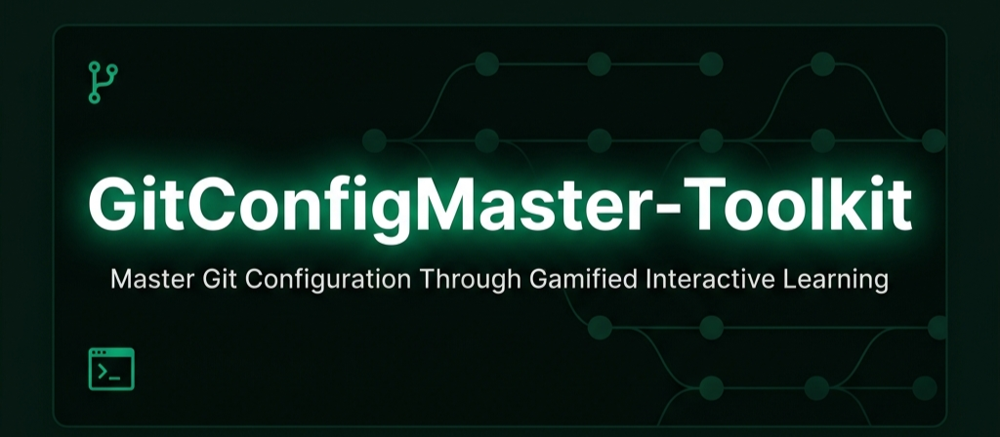

### *Master Git Configuration Through Gamified, Interactive Learning*

> A premium, state-aware, gamified learning environment for mastering Git configuration scopes, command precedence, staging pipelines, and conflict resolution — wrapped in a cinematic sci-fi dashboard experience.

---

[](https://reactjs.org/)
[](https://www.typescriptlang.org/)
[](https://vitejs.dev/)
[](https://tailwindcss.com/)
[](LICENSE)
[](CONTRIBUTING.md)
[](https://github.com/TheOrionGD/GitConfigMaster-Toolkit)
[](https://github.com/TheOrionGD/GitConfigMaster-Toolkit)

</div>

---

## 🧑‍💻 The Developer's Story

> *This section chronicles the human journey behind Git Config Master Toolkit — why it was built, how the team thought through every decision, and what they learned along the way.*

---

### 💡 Project Inspiration

Every developer remembers the first time Git configuration silently betrayed them. A commit attributed to the wrong user. An email from the system scope bleeding into a client project. A `push` that failed for reasons buried three scopes deep. **Godfrey** and **Prithiviiraj** encountered this exact friction — and instead of moving on, they asked a deeper question:

> *"Why is there no immersive, visual way to actually feel how Git configuration works?"*

Documentation exists. Cheat sheets exist. Tutorials exist. But none of them capture the *hierarchy*, the *precedence cascade*, the *pipeline flow* in a way that clicks intuitively. The team decided to build exactly that — a living, breathing simulation where learning is inseparable from doing.

---

### 👥 Meet the Team

| Role | Name | Specialization |
|------|------|---------------|
| 👑 **Lead Architect & UI/UX** | Godfrey | System Architecture, Frontend Engineering, Gamification Design |
| ⚡ **Core Developer & Logic** | Prithiviiraj | Reactor Engine, State Management, Quiz Logic, Animation Systems |

Both developers operate under the **Orion Platform** umbrella (`@orion-os.org`), a collaborative engineering identity focused on building learning tools for the developer community.

---

### 🧩 The Challenge

The problem space had four distinct pain points the team identified early on:

1. **Abstraction Gap** — Git config scope documentation is technically accurate but cognitively disconnected. Reading about `--local > --global > --system` priority rarely translates to an *internalized* mental model.

2. **No Safe Sandbox** — Developers afraid to experiment with config keys on real machines avoid learning them properly. A consequence-free sandbox was essential.

3. **No Gamified Path** — There was no structured, rewarded journey from "beginner who doesn't know where `.gitconfig` lives" to "expert who understands environment variable overrides."

4. **Engagement Cliff** — Even interactive tutorials tend to be passive. The team wanted *active* engagement — temperature meters, countdown timers, XP bars, achievements you can feel.

---

### 🎨 Design Philosophy

The visual direction was decided early: **sci-fi mission control meets developer terminal**. The aesthetic needed to feel:

- **Premium** — Users should feel they've stepped into a serious, polished product.
- **Immersive** — The interface should reinforce the *world* of Git — branches, commits, upstream nodes — through its visual language.
- **Legible** — Despite the sci-fi density, every piece of information must be immediately scannable.

The color system anchors around **Emerald Green** (`#10b981`) — a deliberate choice referencing both terminal culture and the biological "Digital Canopy" metaphor woven through the product's language. Amber and red serve as tension/warning colors during the Reactor game sequences.

Typography combines **Inter** (body legibility) with **Fira Code** (monospace authenticity) — the same fonts professional developers see in their editors every day.

---

### ⚙️ Engineering Journey

The application began as a single `App.tsx` monolith during prototyping — a deliberate choice to keep iteration fast. Once the core state machine (XP, badges, configs, pipeline, reactor) was proven, the team extracted 13 modular components in a surgical refactor:

```
App.tsx [Root State & Logic Orchestrator]
  ├── LandingPage.tsx     [Cinematic Arena Entry Screen]
  ├── GlossaryView.tsx    [Interactive Command Hub + Terminal]
  ├── CheatsheetView.tsx  [Quick Reference Grid]
  ├── ScopesView.tsx      [Configuration Scope Visualizer]
  ├── CampaignsView.tsx   [Mission Quest System]
  ├── BadgesView.tsx      [Achievement Credentials Shelf]
  ├── ReactorView.tsx     [Conflict Resolution Game Engine]
  ├── RegistryEditorView.tsx [Live Config Editor Terminal]
  ├── TeamWorkspaceView.tsx  [Multi-Seat Team Manager]
  ├── DiagnosticsView.tsx    [System Metrics + Health HUD]
  ├── SandboxPipeline.tsx    [Visual Git Pipeline Simulator]
  ├── DigitalCanopy.tsx      [Ambient Background Organism]
  └── CertificateCard.tsx    [Academy Completion Certificate]
```

State is managed entirely through React's `useState` hook with `sessionStorage` synchronization — a deliberate choice to avoid external state libraries, keeping the bundle light and the architecture transparent for educational purposes.

---

### 🔐 Security-First Thinking

Even in a purely client-side learning tool, security principles were applied:

- **No persistent credential storage** — All config values live in `sessionStorage` (cleared on tab close), never `localStorage`. No user data survives browser sessions.
- **Session purge on logout** — The `handleLogout()` function executes a complete `sessionStorage.clear()` before resetting all state to defaults, leaving no residual data.
- **No external API calls with sensitive data** — The application is entirely self-contained. There are no server roundtrips, no user accounts, and no telemetry.
- **Input sanitization** — The Registry Editor validates key formats before storing, preventing malformed config key injection into the simulation state.

---

### 🏗️ Building the Sandbox Pipeline

The visual Git pipeline (`SandboxPipeline.tsx`) was the most architecturally interesting challenge. The team needed to represent a four-stage Git flow — Working Directory → Staging Index → Local Commits → Remote Commits — with:

- **Animated file tokens** moving across the pipeline
- **Real-time log feedback** synchronized with animations
- **XP rewards** triggered at each stage completion
- **Badge unlocks** tied to cumulative pipeline milestones

The state machine for this uses four independent arrays (`workingFiles`, `stagedFiles`, `localCommits`, `remoteCommits`) that files migrate through via delayed `setTimeout` transitions, creating the visual illusion of files physically moving through the pipeline stages.

---

### 🎮 User Experience Decisions

Several UX debates shaped the final product:

**Debate 1: Should the quiz shuffle answers?**
→ *Decision: Yes.* The Reactor quiz shuffles both question selection (from a 30-question bank) and answer order on every session, preventing memorization patterns and forcing genuine comprehension.

**Debate 2: Should the XP system be transparent?**
→ *Decision: Yes.* Every action shows its XP value clearly. Users who understand the reward system engage more consistently than those who don't.

**Debate 3: Should locked badges be hidden?**
→ *Decision: No.* Showing locked badges with their unlock criteria ("Set custom user.name parameter — ✗ PENDING") creates intrinsic motivation. Users know exactly what to do next.

**Debate 4: Should the certificate be printable?**
→ *Decision: Yes.* The `CertificateCard` component is designed with print-friendly CSS, allowing learners to generate a shareable achievement certificate after completing all five missions.

---

### 🧑‍🔬 Technical Challenges & Solutions

| Challenge | Root Cause | Solution |
|-----------|------------|----------|
| Reactor timer drift on re-render | `setInterval` not cleared properly on state change | Dedicated `timerRef` with `useRef` and cleanup in `useEffect` return |
| Badge unlock race condition | Multiple state updaters triggering simultaneously | Centralized `unlockBadge()` function with `includes()` guard before dispatch |
| Pointer drag accuracy on the scope wheel | `getBoundingClientRect()` returning stale values | Computing center from fresh rect on every `pointerdown` event |
| TailwindCSS CDN warning noise | Console pollution from CDN script | Script wrapper that intercepts and filters `cdn.tailwindcss.com` console entries |
| Session persistence across hot-reloads | Vite HMR triggering full remounts | `sessionStorage` initialization inside `useState` lazy initializers |

---

### 🤝 Collaboration Story

The project was built in a series of focused engineering sessions. Godfrey owned the visual architecture — the landing page arena, the scope matrix, the CSS design system, the Digital Canopy organism, and the certificate. Prithiviiraj owned the logic-heavy systems — the Reactor game engine, the quiz bank (30 questions authored from scratch), the badge criteria validators, and the audio synthesis engine.

Code reviews happened inline through shared session contexts rather than pull requests, with each developer running the Vite dev server simultaneously and communicating changes verbally. The final integration pass was collaborative — both developers present as the state system was wired across all 13 components.

---

### 📚 Lessons Learned

1. **Start monolithic, extract modularly.** Beginning in a single file allowed rapid iteration on state design before committing to component boundaries.

2. **Gamification needs real stakes.** The Reactor's temperature meter and countdown clock create genuine tension — without those pressure elements, the quiz feels trivial.

3. **Session-only storage is UX-honest.** Users starting fresh each time removes the awkward "I already did this" problem common in tutorials.

4. **Web Audio API is underestimated.** The synthesizer feedback sounds (`playSynthSound`) took a day to tune but add enormous emotional texture — success, failure, level-up, and reactor alarm sounds feel distinctly different and reinforce learning events.

5. **Dark mode is table stakes.** Every UI element was designed dark-first. A light mode would require a complete design rethink, not just color inversion.

---

### 🔭 Future Vision

The team has a clear roadmap for where Git Config Master Toolkit evolves next:

- **Multi-player Arena Mode** — Real-time competitive quiz sessions between teams
- **AI Config Advisor** — Natural language config queries powered by an LLM integration
- **Git Graph Visualizer** — A DAG renderer showing branch history evolving in real time
- **Extended Command Bank** — Expanding the 30-question Reactor bank to 100+ questions across advanced topics (reflog, bisect, worktrees)
- **VS Code Extension** — Embedding the learning modules directly inside the developer's primary workspace
- **Backend Leaderboard** — Persistent global rankings with authenticated user profiles

---

### 🏷️ Behind the Name

**"Git Config Master"** was chosen for direct clarity — the primary learning objective is configuration mastery. The subtitle "Toolkit" was added deliberately: this is not a passive tutorial but an active set of interactive instruments.

The internal project codename during development was **"Git Biosphere"** — visible in the HTML `<title>` tag — reflecting the biological metaphor system woven through the UI language: "canopy," "ecosystem," "strata," "carbon," "oxygenizer." Git concepts map to ecological processes in the UI's copy, reinforcing retention through unexpected analogical connections.

---

### 💌 Message from the Developers

> *"We built Git Config Master Toolkit because we believe the best way to learn a tool is to feel it — not just read about it. Every animation, every sound, every XP tick was designed to make configuration concepts land at the level of muscle memory, not just intellectual understanding.*
> 
> *If this tool helped you finally understand why* `--local` *beats* `--global` *beats* `--system`*, or why your commits were showing the wrong email, then we did our job.*
>
> *Go build something with confidence."*
>
> — **Godfrey & Prithiviiraj**, Platform Architects, Orion-OS

---

## 📑 Table of Contents

<details>
<summary><strong>Click to expand full navigation</strong></summary>

- [📌 Overview](#-overview)
- [✨ Key Features](#-key-features)
- [🏗️ System Architecture](#️-system-architecture)
  - [High-Level Architecture Diagram](#high-level-architecture-diagram)
  - [Component Dependency Tree](#component-dependency-tree)
  - [State Management Flow](#state-management-flow)
- [🗂️ Folder Structure](#️-folder-structure)
- [🧩 Modules & Components](#-modules--components)
  - [Core Application Shell](#1-core-application-shell-apptsx)
  - [Landing Page Arena](#2-landing-page-arena-landingpagetsx)
  - [Git Command Glossary](#3-git-command-glossary-glossaryviewtsx)
  - [Visual Pipeline Sandbox](#4-visual-pipeline-sandbox-sandboxpipelinetsx)
  - [Conflict Resolution Reactor](#5-conflict-resolution-reactor-reactorviewtsx)
  - [Achievement Badges System](#6-achievement-badges-system-badgesviewtsx)
  - [Quest Campaigns Engine](#7-quest-campaigns-engine-campaignsviewtsx)
  - [Registry Config Editor](#8-registry-config-editor-registryeditorviewtsx)
  - [Configuration Scopes View](#9-configuration-scopes-view-scopesviewtsx)
  - [Command Cheatsheet](#10-command-cheatsheet-cheatsheetviewtsx)
  - [Team Workspace Manager](#11-team-workspace-manager-teamworkspaceviewtsx)
  - [System Diagnostics HUD](#12-system-diagnostics-hud-diagnosticsviewtsx)
  - [Digital Canopy Organism](#13-digital-canopy-organism-digitalcanopytsx)
  - [Academy Certificate](#14-academy-certificate-certificatecardtsx)
- [🎮 Gamification System](#-gamification-system)
  - [XP & Level Progression](#xp--level-progression)
  - [Achievement Badges](#achievement-badges)
  - [Mission Campaigns](#mission-campaigns)
  - [Conflict Reactor Game](#conflict-reactor-game)
- [📊 Git Configuration Reference](#-git-configuration-reference)
  - [Scope Hierarchy & Priority](#scope-hierarchy--priority)
  - [Configuration Precedence Diagram](#configuration-precedence-diagram)
  - [Core Configuration Keys](#core-configuration-keys)
- [🛠️ Technology Stack](#️-technology-stack)
- [⚡ Getting Started](#-getting-started)
  - [Prerequisites](#prerequisites)
  - [Installation](#installation)
  - [Running Locally](#running-locally)
  - [Building for Production](#building-for-production)
- [⚙️ Configuration Reference](#️-configuration-reference)
  - [Vite Configuration](#vite-configuration)
  - [TypeScript Configuration](#typescript-configuration)
  - [Environment Variables](#environment-variables)
- [🔄 Application Workflows](#-application-workflows)
  - [User Onboarding Flow](#user-onboarding-flow)
  - [XP Reward Pipeline](#xp-reward-pipeline)
  - [Badge Unlock Sequence](#badge-unlock-sequence)
  - [Reactor Game Loop](#reactor-game-loop)
- [🔊 Audio Synthesis Engine](#-audio-synthesis-engine)
- [💾 Session Storage Schema](#-session-storage-schema)
- [📱 Responsive Design](#-responsive-design)
- [🎨 Design System](#-design-system)
  - [Color Palette](#color-palette)
  - [Typography](#typography)
  - [Animation Tokens](#animation-tokens)
- [🧪 Testing](#-testing)
  - [Manual Testing Checklist](#manual-testing-checklist)
  - [Browser Compatibility](#browser-compatibility)
- [🚀 Deployment](#-deployment)
  - [Static Hosting (Recommended)](#static-hosting-recommended)
  - [Docker Deployment](#docker-deployment)
  - [CI/CD Pipeline](#cicd-pipeline)
- [🔒 Security & Privacy](#-security--privacy)
- [📈 Scalability Considerations](#-scalability-considerations)
- [🐛 Troubleshooting](#-troubleshooting)
- [❓ Frequently Asked Questions](#-frequently-asked-questions)
- [🤝 Contributing](#-contributing)
- [📄 License](#-license)
- [🙏 Acknowledgements](#-acknowledgements)

</details>

---

## 📌 Overview

**Git Config Master Toolkit** is a fully client-side, gamified interactive learning platform designed to transform how developers internalize Git configuration fundamentals. Rather than passively reading documentation, users engage with a richly animated, mission-driven environment where every Git concept is demonstrated through hands-on simulation.

The platform covers the complete Git configuration knowledge domain:

- **Scope Hierarchy** — Understanding `--system`, `--global`, and `--local` priority layers
- **Precedence Rules** — How Git resolves conflicting values across scopes and environment variables
- **Command Reference** — A browsable, filterable database of 80+ Git commands across 15 categories
- **Visual Pipeline** — Animated simulation of the Working Directory → Staging → Local Commit → Remote Push workflow
- **Conflict Reactor** — A timed, gamified quiz requiring rapid Git precedence knowledge under pressure
- **Configuration Management** — A live registry editor simulating real `git config` command execution

The application targets **professional developers**, **computer science students**, **DevOps engineers**, and **open source contributors** who want to move beyond surface-level Git knowledge into confident, precise configuration expertise.

### What Makes This Different

| Approach | Traditional Tutorials | Git Config Master |
|----------|-----------------------|-------------------|
| **Learning Style** | Passive reading | Active simulation |
| **Feedback Loop** | Deferred (quiz at end) | Immediate (XP, sounds, animations) |
| **Knowledge Retention** | Low (forgetting curve steep) | High (gamified repetition) |
| **Configuration Sandbox** | None (real system risk) | Safe, session-isolated simulator |
| **Visual Representation** | Static diagrams | Live animated pipeline |
| **Engagement Model** | Linear progression | Multi-path, campaign-based |

---

## ✨ Key Features

### 🎮 Gamification Engine
- **XP System** — Every action earns experience points: staging files (+30 XP), committing (+50 XP), pushing (+80 XP), completing missions (+150–250 XP), unlocking badges (+60 XP)
- **Level Progression** — Five distinct ranks from Beginner (0 XP) to Repository Master (800+ XP), each unlocking new platform capabilities
- **Achievement Badges** — Six collectible achievement seals with live criteria diagnostics and one-click claim verification
- **Session Persistence** — Complete learning state preserved across page refreshes via `sessionStorage`

### 🛠️ Interactive Learning Modules
- **Configuration Registry Editor** — Real-time `git config` command simulator with scope-aware key/value management
- **Visual Git Pipeline** — Animated Working Directory → Staging → Local → Remote workflow with live log output
- **Ecosystem Command Hub** — Interactive terminal with holographic command visualizations
- **Conflict Resolution Reactor** — Timed quiz engine drawing from a 30-question randomized bank

### 📚 Comprehensive Reference Materials
- **Git Command Database** — 80+ commands organized across 15 operational categories
- **Configuration Scope Matrix** — Priority table with file paths, scope descriptions, and access levels
- **Interactive Cheatsheet** — Quick-reference command cards with copy functionality
- **Git Glossary** — Filterable command reference with live terminal simulation

### 🎨 Premium Visual Experience
- **Sci-Fi Mission Control UI** — Dark theme with emerald green accent system and animated HUD elements
- **Web Audio Synthesizer** — Five distinct synthesized sound events (click, success, levelup, error, reactor)
- **Holographic Projection Array** — Visual command execution animations tied to terminal input
- **Draggable Scope Priority Wheel** — Pointer-event-driven interactive precedence dial
- **Digital Canopy Organism** — Ambient animated background representing the Git repository tree

### 👥 Team Workspace Simulator
- **Multi-seat Team Management** — Add team members with Admin, Developer, and Security roles
- **Activity Kiosk Feed** — Live-scrolling log of all platform events, configuration changes, and badge unlocks
- **Leaderboard System** — Top-rated operator rankings with XP, streak, and badge information

### 🏆 Academy Certificate
- Completable, print-ready achievement certificate generated upon finishing all five missions
- Includes learner name, completion timestamp, and mission summary

---

## 🏗️ System Architecture

### High-Level Architecture Diagram

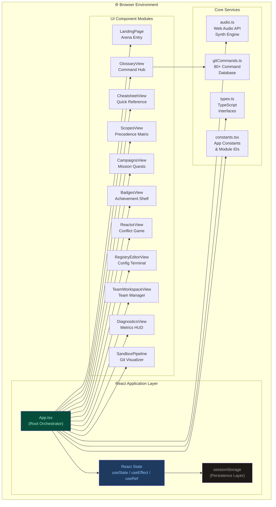

### Component Dependency Tree

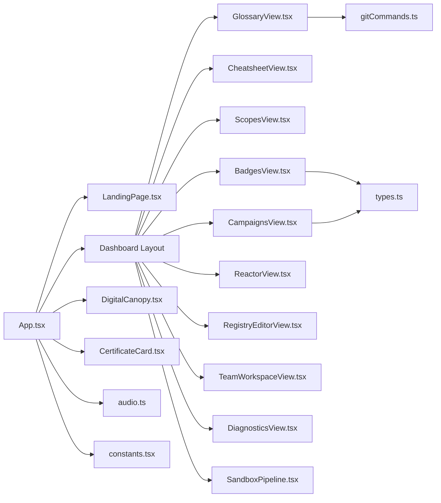

### State Management Flow

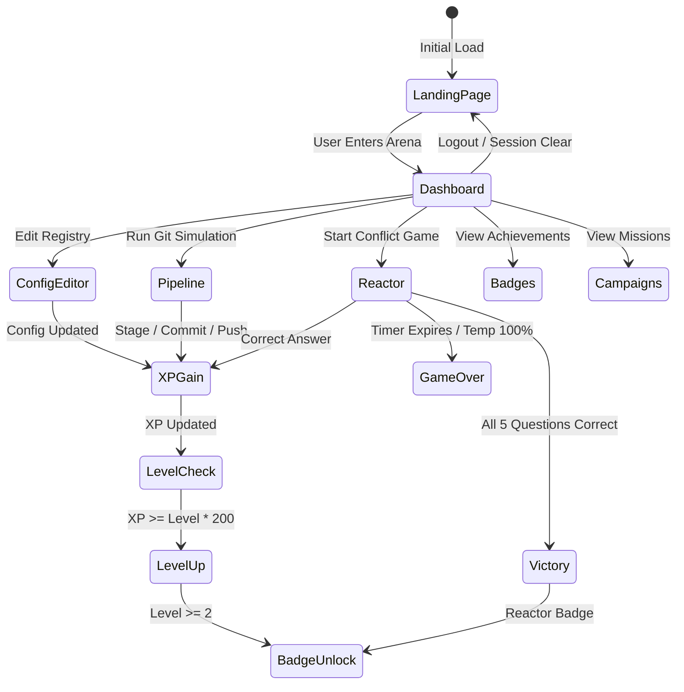

---

## 🗂️ Folder Structure

```
GitConfigMaster-Toolkit/
│
├── 📄 index.html                    # Application entry point with TailwindCSS CDN, fonts, importmap
├── 📄 index.tsx                     # React root renderer
├── 📄 App.tsx                       # Root component — all state, effects, and handler logic
├── 📄 gitCommands.ts                # Complete Git command database (80+ commands, 15 categories)
├── 📄 audio.ts                      # Web Audio API synthesizer engine (5 sound types)
├── 📄 types.ts                      # TypeScript interface definitions
├── 📄 constants.tsx                 # INITIAL_CONFIGS, SCOPES, MODULE_IDS constants
├── 📄 index.css                     # Global CSS design system and animation keyframes
├── 📄 vite.config.ts                # Vite build configuration (port 3000, React plugin, aliases)
├── 📄 tsconfig.json                 # TypeScript compiler configuration
├── 📄 package.json                  # Node.js project manifest and NPM scripts
├── 📄 package-lock.json             # Locked dependency tree
├── 📄 metadata.json                 # Project metadata descriptor
├── 📄 .gitignore                    # Git ignore rules (node_modules, dist, logs, IDE files)
│
└── 📁 components/                   # Modular UI component library
    ├── 📄 LandingPage.tsx            # Cinematic arena entry with live HUD metrics
    ├── 📄 GlossaryView.tsx           # Interactive terminal + holographic visualizer + command DB
    ├── 📄 CheatsheetView.tsx         # Quick-reference command cheat sheet grid
    ├── 📄 ScopesView.tsx             # Git configuration scope hierarchy visualizer
    ├── 📄 CampaignsView.tsx          # Structured mission quest system (5 campaigns)
    ├── 📄 BadgesView.tsx             # Achievement credential shelf with live criteria
    ├── 📄 ReactorView.tsx            # Timed conflict resolution quiz game engine
    ├── 📄 RegistryEditorView.tsx     # Live git config registry editor and simulator
    ├── 📄 TeamWorkspaceView.tsx      # Multi-seat team workspace management panel
    ├── 📄 DiagnosticsView.tsx        # System health metrics and telemetry dashboard
    ├── 📄 SandboxPipeline.tsx        # Visual animated Git workflow pipeline simulator
    ├── 📄 DigitalCanopy.tsx          # Ambient background organism animation component
    └── 📄 CertificateCard.tsx        # Printable academy completion certificate generator
```

---

## 🧩 Modules & Components

### 1. Core Application Shell (`App.tsx`)

The root component is a comprehensive state orchestrator managing the entire application's lifecycle. It holds all shared state and exposes handler functions as props to child components.

**Key State Domains:**

| State Group | Variables | Purpose |
|------------|-----------|---------|
| **Navigation** | `showDashboard`, `activeModule` | Controls Landing → Dashboard transition and active view |
| **Configuration** | `configs` (key-value map) | Live simulation of `~/.gitconfig` registry |
| **Gamification** | `xp`, `level`, `masteredMissions`, `earnedBadges` | Complete progression tracking |
| **Pipeline** | `workingFiles`, `stagedFiles`, `localCommits`, `remoteCommits` | Git workflow simulation state |
| **Reactor Game** | `reactorState`, `reactorTemp`, `reactorTimer`, `reactorQuestionIdx` | Timed quiz game engine state |
| **Team** | `teamMembers`, `newMemberEmail`, `newMemberRole` | Workspace seat management |
| **UI Feedback** | `animationState`, `shakeOn`, `kioskLogs`, `visualLogs` | Visual and audio feedback coordination |

**Core Handler Functions:**

```typescript
// Git Pipeline Simulation
handleGitAdd()     // Moves workingFiles → stagedFiles (+30 XP, oxygenizer badge)
handleGitCommit()  // Moves stagedFiles → localCommits (+50 XP, carbon badge)
handleGitPush()    // Moves localCommits → remoteCommits (+80 XP, canopy badge)
handleReset()      // Resets pipeline to initial state

// Configuration Management
handleUpdateConfig(key, val)  // Updates config map + simulates git config terminal output
handleRemoveConfig(key)       // Removes key from config + simulates --unset terminal output

// Gamification
unlockBadge(badgeId)          // Awards badge if not already earned (+60 XP bonus)
startReactorGame()            // Shuffles 30-question bank, selects 5, starts timer
handleReactorAnswer(optIdx)   // Validates answer, adjusts reactor temperature

// Session
handleLogout()                // Clears sessionStorage, resets all state to defaults
```

---

### 2. Landing Page Arena (`LandingPage.tsx`)

The first screen users encounter — a full-screen cinematic mission briefing with live simulated telemetry.

**Live Metrics (Simulated):**
- **Operators Online** — Fluctuates by ±3 every 4 seconds around ~4,821
- **Latency Pin** — Varies ±2ms every 4 seconds around 14ms baseline
- **Arena Zone** — Static "ORION-PRIMARY" designation

**Sections:**
1. **Platform Status HUD** — Top bar with live metrics and animated ping indicator
2. **Hero Arena** — Massive title treatment with gradient typography
3. **Live Console Widget** — Animated terminal cycling through 7 system boot messages
4. **Campaign Tracks Grid** — Three difficulty-tiered learning path cards (Novice / Intermediate / Expert)
5. **Gamification Playbook** — Six-card explanation of XP, levels, badges, sandbox, reactor, and certificates
6. **Configuration Precedence Matrix** — Interactive table showing scope priorities
7. **Arena Leaderboard** — Mock top-4 operator rankings with XP and streak data
8. **Level Progression Roadmap** — Vertical timeline from L1 Beginner to L5 Repository Master
9. **System Engine Diagnostics** — Four metric cards (CPU, Memory, Audio, SSL)

---

### 3. Git Command Glossary (`GlossaryView.tsx`)

A dual-panel interactive environment combining a live terminal simulator with a categorized command reference database.

**Left Panel — Holographic Projection Array:**

Renders animated visualizations based on the last executed command:

| Command | Holographic Animation |
|---------|----------------------|
| `git init` | Spinning shield box with amber ring |
| `git add` | File token animating from Working Dir → Staging Index |
| `git commit` | Pulsing commit node with hash identifier |
| `git push` | Package floating upward toward cloud with trajectory trail |
| `git merge` | Branch arc converging at a merge commit node |
| `git status` / `git log` / `git branch` | Bouncing diagnostic icon with progress scan bar |

**Right Panel — Terminal Console:**

- Accepts `git *` command input
- Displays chronological log output with color coding:
  - `$` prefix: bright command lines
  - `>` prefix: amber system response
  - plain text: muted system logs
- `clear` command resets log to initial state

**Bottom Panel — Command Database:**

A filterable grid of commands organized into 10 categories. Clicking any command card auto-populates the terminal input and scrolls to the top.

```
Categories:
1. Getting Started     | git init, git clone
2. Day-To-Day Work     | git status, git add, git commit
3. Branching           | git branch, git checkout, git switch
4. Merging & Rebasing  | git merge, git rebase
5. Inspection          | git log, git diff, git show
6. Remote Sync         | git push, git pull, git fetch
7. Undoing Changes     | git revert, git reset, git restore
8. Stashing            | git stash, git stash pop, git stash list
9. Tagging             | git tag, git push --tags
10. Configuration      | git config --global, git config --list
```

---

### 4. Visual Pipeline Sandbox (`SandboxPipeline.tsx`)

An animated four-stage Git workflow visualizer that brings the commit pipeline to life.

**Pipeline Stages:**

```
┌─────────────────┐    git add     ┌─────────────────┐
│  Working        │ ─────────────► │  Staging        │
│  Directory      │                │  Index          │
│  index.js       │                │  (tracked)      │
│  styles.css     │                └────────┬────────┘
└─────────────────┘                         │ git commit
                                            ▼
┌─────────────────┐    git push    ┌─────────────────┐
│  Remote         │ ◄───────────── │  Local          │
│  Commits        │                │  Commits        │
│  (origin/main)  │                │  (HEAD)         │
└─────────────────┘                └─────────────────┘
```

**Animation States:**

| State | Visual Behavior |
|-------|----------------|
| `idle` | Static file tokens, no movement |
| `adding` | Files slide from Working Dir to Staging with 1.8s transition |
| `committing` | Staged files collapse into commit node with hash generation |
| `pushing` | Commit tokens migrate to remote column with upstream sync message |

**Log Output Examples:**
```
Executing [git add .] -> Indexing local workspace files...
SUCCESS: Files staging complete. Changes added to Index.
Executing [git commit -m "feat: user profile"] -> Creating new local commit...
SUCCESS: Commit created. HASH: [A3F2C] -> Changes saved locally.
Executing [git push origin main] -> Transferring local commits to remote origin...
SUCCESS: Upstream remote synchronization complete.
```

---

### 5. Conflict Resolution Reactor (`ReactorView.tsx`)

A high-stakes timed quiz game built on Git configuration knowledge.

**Game Mechanics:**

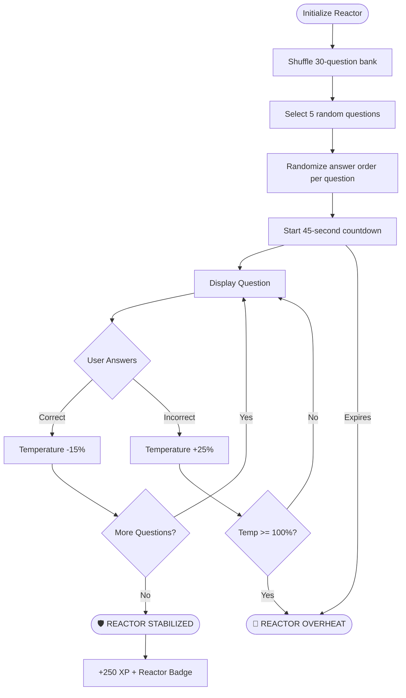

**Temperature Management:**
- Starting temperature: 50%
- Correct answer: -15% (cools the reactor)
- Wrong answer: +25% (heats the reactor)
- Game ends immediately if temperature reaches 100%

**Question Bank Topics (30 questions):**

| Category | Question Count |
|----------|---------------|
| Scope Priority Rules | 6 |
| Config File Paths | 4 |
| Config Commands (list, edit, unset) | 5 |
| Core Config Keys (editor, autocrlf, defaultBranch) | 3 |
| Git Workflow Operations (add, commit, push, pull) | 8 |
| Environment Variable Overrides | 2 |
| Conflict & Merge Concepts | 2 |

---

### 6. Achievement Badges System (`BadgesView.tsx`)

A dynamic credential shelf displaying six achievement seals with live criteria verification.

**Badge Catalog:**

| Badge ID | Icon | Label | Unlock Condition |
|----------|------|-------|-----------------|
| `arborist` | 🌳 | Configuration Primer | Set custom `user.name` AND `user.email` (non-default values) |
| `oxygenizer` | ⚗️ | Staging Area | Stage at least one file using `git add` |
| `carbon` | 💎 | Commit Logger | Create at least one local commit |
| `canopy` | ☁️ | Remote Upstream | Push at least one commit to remote |
| `precedence` | 🧠 | Precedence Sage | Reach Level 2 progression |
| `reactor` | ⚛️ | Reactor Master | Achieve victory in the Conflict Reactor game |

**Badge Card States:**
- **Locked** — Dimmed card with "LOCKED OVERRIDE" tag and pending criteria checklist
- **Criteria Met, Not Claimed** — Glowing amber "⚡ CLICK TO SEAL" CTA
- **Unlocked & Sealed** — Full-color card with "SEALED & SYNCD" tag and decorative radial blur

---

### 7. Quest Campaigns Engine (`CampaignsView.tsx`)

Five structured learning missions with tracked progress, XP rewards, and badge unlocks.

**Mission Structure:**

| Mission ID | Title | Difficulty | XP | Badge |
|-----------|-------|----------|-----|-------|
| `m1` | Configuration Prioritization | Basic | 150 | arborist |
| `m2` | Local File Staging | Basic | 150 | oxygenizer |
| `m3` | Commit Logs | Intermediate | 150 | carbon |
| `m4` | Remote Upstream Sync | Intermediate | 150 | canopy |
| `m5` | Conflict Reactor Challenge | Advanced | 250 | reactor |

Each campaign renders step-by-step progress items that automatically check against live application state. Completing all steps marks the mission as mastered.

---

### 8. Registry Config Editor (`RegistryEditorView.tsx`)

A live configuration management terminal that simulates `git config` command execution.

**Simulated Commands:**

When a key-value is updated, the kiosk log emits:
```bash
$ git config --global user.name "Godfrey"
[global] user.name updated to "Godfrey"
```

When a key is removed:
```bash
$ git config --global --unset user.email
[global] user.email profile credential purged
```

**Default Registry State:**

```ini
[global]
    user.name    = Learner
    user.email   = learner@example.com
    core.editor  = vim
    init.defaultBranch = main
```

Custom keys can be added using the Registry Editor form, which accepts arbitrary key names and values, making it suitable for demonstrating `alias.*`, `http.*`, `credential.*`, and other advanced config domains.

---

### 9. Configuration Scopes View (`ScopesView.tsx`)

A focused educational module presenting the Git configuration scope hierarchy with a draggable interactive priority wheel.

**Scope Data:**

```typescript
const SCOPES = [
  { id: 'local',  name: 'Local',  priority: 1, description: 'Specific to one repository' },
  { id: 'global', name: 'Global', priority: 2, description: 'User-wide across all repos' },
  { id: 'system', name: 'System', priority: 3, description: 'All users on the system' },
];
```

The interactive wheel uses pointer events for drag-to-rotate interaction, with snap points at 40° intervals. Rotation tracks `dragStartAngle`, `dragStartRotation`, and active `isDragging` state, with `pointerCapture` ensuring smooth tracking even when the cursor leaves the element boundary.

---

### 10. Command Cheatsheet (`CheatsheetView.tsx`)

A compact, printable-friendly quick-reference module displaying the most commonly used Git commands in a scannable grid format.

Commands are organized into logical workflow sections and include copy-to-clipboard functionality for rapid terminal usage.

---

### 11. Team Workspace Manager (`TeamWorkspaceView.tsx`)

Simulates a multi-seat team configuration environment.

**Team Member Schema:**

```typescript
interface TeamMember {
  email: string;
  role: 'Admin' | 'Developer' | 'Security';
  status: 'Active' | 'Pending';
  avatar: string;  // First two letters of email, uppercase
}
```

Default team members pre-populated from the Orion-OS organization:

| Member | Role | Status | Avatar |
|--------|------|--------|--------|
| godfrey@orion-os.org | Admin | Active | GT |
| prithvi@orion-os.org | Developer | Active | PR |
| harihar@orion-os.org | Security | Active | HR |

New members can be invited through the seat form. Invited members start with `Pending` status until activated.

---

### 12. System Diagnostics HUD (`DiagnosticsView.tsx`)

A real-time system health monitoring panel displaying four core metrics:

| Metric | Label | Value | Indicator |
|--------|-------|-------|-----------|
| Simulation CPU | Engine Health | 99.8% OK | Green progress bar |
| Registry Memory | Memory Leaks | 0.00% | Full green bar |
| Synth Frequency | Audio Engine | Dual VCO Active | Amber pulse bar |
| SSL Cryptography | Connection Security | TLS 1.3 Active | Cyan full bar |

---

### 13. Digital Canopy Organism (`DigitalCanopy.tsx`)

A purely visual, ambient background component that renders an animated biological tree-like structure representing the Git repository. The organism responds to application state changes, growing more complex as the user advances through learning milestones.

---

### 14. Academy Certificate (`CertificateCard.tsx`)

Generated upon completing all five active missions. The certificate includes:

- Learner name (pulled from `user.name` config)
- Completion date and timestamp
- List of completed missions with mission titles
- Orion-OS Academy seal and signature
- Print-ready CSS (`@media print`) for physical or PDF output

---

## 🎮 Gamification System

### XP & Level Progression

The XP system is designed to reward both depth of exploration and breadth of interaction.

**XP Award Schedule:**

| Action | XP Awarded |
|--------|-----------|
| Stage files (`git add`) | +30 XP |
| Create commit (`git commit`) | +50 XP |
| Push to remote (`git push`) | +80 XP |
| Unlock a badge | +60 XP |
| Win Reactor game | +250 XP |
| Starting XP (new session) | 50 XP |

**Level Thresholds:**

```
Level × 200 XP = Threshold to advance

Level 1 → 2: 200 XP   (Beginner → Intermediate)
Level 2 → 3: 400 XP   (Intermediate → Advanced)
Level 3 → 4: 600 XP   (Advanced → Professional)
Level 4 → 5: 800 XP   (Professional → Repository Master)
```

**Level Up Sequence:**
1. `xp >= level * 200` detected in `useEffect`
2. `setLevel(prev => prev + 1)` dispatched
3. `triggerSound('levelup')` fires ascending tone sequence
4. Kiosk log emits `LEVEL UP! You are now level N!`
5. `unlockBadge('precedence')` called if level >= 2

---

### Achievement Badges

Badges are evaluated through a live criteria checker (`checkBadgeCriteria()`) that inspects real application state. There is no artificial time delay — badges become available the moment their criteria are satisfied.

```typescript
const checkBadgeCriteria = (badgeId: string): boolean => {
  switch (badgeId) {
    case 'arborist':
      return !!(configs['user.name'] && configs['user.name'] !== 'Learner'
             && configs['user.email'] && configs['user.email'] !== 'learner@example.com');
    case 'oxygenizer':
      return stagedFiles.length > 0 || localCommits.length > 0 || remoteCommits.length > 0;
    case 'carbon':
      return localCommits.length > 0 || remoteCommits.length > 0;
    case 'canopy':
      return remoteCommits.length > 0;
    case 'precedence':
      return level >= 2;
    case 'reactor':
      return reactorState === 'victory';
  }
};
```

---

### Mission Campaigns

Campaigns provide structured, goal-oriented learning paths. Each mission's steps check against live application state, creating a tight feedback loop between learning actions and progress tracking.

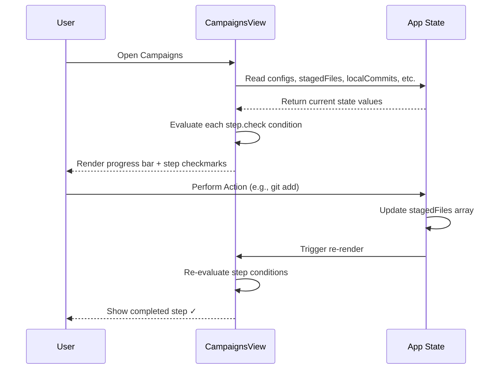

---

### Conflict Reactor Game

The Reactor is the platform's highest-stakes module, designed to test knowledge under pressure.

**Question Randomization Algorithm:**

```typescript
const startReactorGame = () => {
  // Step 1: Shuffle all 30 questions
  const shuffledPool = [...ALL_30_QUESTIONS].sort(() => Math.random() - 0.5);

  // Step 2: Select top 5 from shuffled pool
  const selected = shuffledPool.slice(0, 5).map(item => {
    // Step 3: Pair options with their correctness
    const pairedOptions = item.opts.map((opt, oidx) => ({
      text: opt,
      isCorrect: oidx === item.ans
    }));
    // Step 4: Shuffle answer order, track new correct index
    const shuffledPairs = pairedOptions.sort(() => Math.random() - 0.5);
    return {
      q: item.q,
      opts: shuffledPairs.map(p => p.text),
      ans: shuffledPairs.findIndex(p => p.isCorrect)
    };
  });
};
```

This ensures both question and answer order are randomized independently on every game start, preventing pattern memorization.

---

## 📊 Git Configuration Reference

### Scope Hierarchy & Priority

Git resolves configuration values using a strict priority cascade:

```
Priority Order (Highest → Lowest):
━━━━━━━━━━━━━━━━━━━━━━━━━━━━━━━━━━━━━━━━

  1st  ╔═══════════════════════════════════╗
       ║  Environment Variables            ║  GIT_AUTHOR_NAME, GIT_COMMITTER_EMAIL
       ║  CLI Parameters (-c flag)         ║  git -c user.name="Override" commit
       ╚═══════════════════════════════════╝
  
  2nd  ╔═══════════════════════════════════╗
       ║  Local Config  [--local]          ║  .git/config (repository-specific)
       ╚═══════════════════════════════════╝
  
  3rd  ╔═══════════════════════════════════╗
       ║  Global Config [--global]         ║  ~/.gitconfig (user-wide)
       ╚═══════════════════════════════════╝
  
  4th  ╔═══════════════════════════════════╗
       ║  System Config [--system]         ║  /etc/gitconfig (machine-wide)
       ╚═══════════════════════════════════╝
```

### Configuration Precedence Diagram

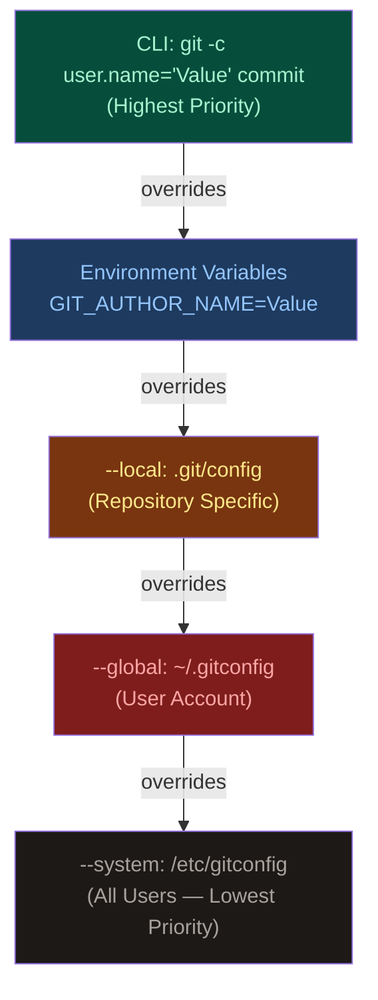

### Core Configuration Keys

| Key | Scope | Purpose | Example Value |
|-----|-------|---------|---------------|
| `user.name` | global | Commit author name | `"Godfrey Thomas"` |
| `user.email` | global | Commit author email | `"godfrey@orion-os.org"` |
| `core.editor` | global | Default commit message editor | `"vim"`, `"code --wait"` |
| `init.defaultBranch` | global | Default branch name on `git init` | `"main"` |
| `core.autocrlf` | global | Line ending normalization | `true` (Win), `input` (Mac/Linux) |
| `core.fileMode` | local | Track file permission changes | `true` / `false` |
| `core.excludesfile` | global | Global gitignore file path | `"~/.gitignore_global"` |
| `alias.*` | global | Custom command shortcuts | `alias.st = status` |
| `http.proxy` | global | HTTP proxy configuration | `"http://proxy:8080"` |
| `credential.helper` | global | Credential storage backend | `"osxkeychain"`, `"store"` |

**View All Configuration:**
```bash
# All config with source file paths
git config --list --show-origin

# Global only
git config --global --list

# Local only
git config --local --list

# System only
git config --system --list
```

---

## 🛠️ Technology Stack

| Layer | Technology | Version | Role |
|-------|-----------|---------|------|
| **UI Framework** | React | 19.2.3 | Component architecture and reactive rendering |
| **Language** | TypeScript | 5.8.2 | Type-safe development with interface contracts |
| **Build Tool** | Vite | 6.2.0 | Lightning-fast HMR dev server and optimized production builds |
| **Styling** | TailwindCSS | CDN | Utility-first styling with custom dark theme tokens |
| **Fonts** | Google Fonts | — | Inter (body) + Fira Code (monospace terminal) |
| **Audio** | Web Audio API | Native | Synthesized interaction sound effects |
| **Persistence** | sessionStorage | Native | Temporary session-scoped state persistence |
| **React Plugin** | @vitejs/plugin-react | 5.0.0 | Vite integration for React JSX/TSX compilation |
| **Type Definitions** | @types/node | 22.14.0 | Node.js type definitions for Vite config |

**Architectural Decisions:**

- **No external state library** — React `useState` was sufficient for the data complexity, keeping the bundle lean and the architecture transparent for educational purposes
- **No backend** — Fully client-side eliminates infrastructure cost and operational overhead; all Git simulation is achieved through React state transitions
- **TailwindCSS CDN** — Used over a compiled Tailwind setup for zero-config simplicity; console warnings from the CDN are suppressed via a script wrapper
- **sessionStorage over localStorage** — Deliberate security decision; user progress does not persist across browser sessions, preventing stale state accumulation

---

## ⚡ Getting Started

### Prerequisites

Ensure your development environment includes:

| Requirement | Minimum Version | Recommended |
|-------------|----------------|-------------|
| **Node.js** | 18.0.0 | 20.x LTS |
| **npm** | 9.0.0 | 10.x |
| **Browser** | Chrome 90+ / Firefox 90+ / Safari 15+ | Chrome latest |
| **Git** | 2.28+ | Latest |

Verify your environment:

```bash
node --version    # v20.x.x
npm --version     # 10.x.x
git --version     # git version 2.4x.x
```

### Installation

**1. Clone the repository:**

```bash
git clone https://github.com/TheOrionGD/GitConfigMaster-Toolkit.git
cd GitConfigMaster-Toolkit
```

**2. Install dependencies:**

```bash
npm install
```

This installs the following dependency tree:

```
GitConfigMaster-Toolkit
├── react@19.2.3
├── react-dom@19.2.3
├── @vitejs/plugin-react@5.0.0 (dev)
├── @types/node@22.14.0 (dev)
├── typescript@5.8.2 (dev)
└── vite@6.2.0 (dev)
```

**3. Verify installation:**

```bash
npm run lint
```

A clean output (no TypeScript errors) confirms successful installation.

### Running Locally

Start the Vite development server:

```bash
npm run dev
```

The application will be available at:

```
Local:   http://localhost:3000
Network: http://0.0.0.0:3000
```

> **Note:** The Vite config sets `host: '0.0.0.0'` enabling LAN access from other devices on your network. This is useful for testing on mobile devices.

**Hot Module Replacement (HMR)** is enabled by default. Any changes to `.tsx`, `.ts`, or `.css` files will reflect instantly in the browser without a full page reload.

### Building for Production

Generate an optimized production build:

```bash
npm run build
```

Build artifacts are output to the `/dist` directory:

```
dist/
├── index.html
├── assets/
│   ├── index-[hash].js    (minified JS bundle)
│   └── index-[hash].css   (extracted CSS)
```

**Preview the production build locally:**

```bash
npm run preview
```

This runs a local static server serving the `dist/` folder for final pre-deployment validation.

---

## ⚙️ Configuration Reference

### Vite Configuration

**`vite.config.ts`:**

```typescript
import path from 'path';
import { defineConfig, loadEnv } from 'vite';
import react from '@vitejs/plugin-react';

export default defineConfig(({ mode }) => {
  const env = loadEnv(mode, '.', '');
  return {
    server: {
      port: 3000,      // Development server port
      host: '0.0.0.0', // Bind to all interfaces (LAN accessible)
    },
    plugins: [react()],
    define: {
      // Environment variable injection for Gemini API key (future use)
      'process.env.API_KEY': JSON.stringify(env.GEMINI_API_KEY),
      'process.env.GEMINI_API_KEY': JSON.stringify(env.GEMINI_API_KEY)
    },
    resolve: {
      alias: {
        '@': path.resolve(__dirname, '.'), // Root-relative imports
      }
    }
  };
});
```

To change the development port, modify the `server.port` value:

```typescript
server: {
  port: 5173,  // Change to any available port
}
```

### TypeScript Configuration

**`tsconfig.json` key settings:**

```json
{
  "compilerOptions": {
    "target": "ES2020",
    "module": "ESNext",
    "moduleResolution": "bundler",
    "jsx": "react-jsx",
    "strict": true,
    "noEmit": true
  }
}
```

The `strict: true` mode enforces:
- `strictNullChecks` — All nullable types must be explicitly handled
- `noImplicitAny` — All variables require explicit or inferred types
- `strictFunctionTypes` — Function parameter types are validated covariantly

### Environment Variables

Create a `.env.local` file in the root for local development overrides:

```env
# Optional: Gemini API Key for future AI features
GEMINI_API_KEY=your_api_key_here
```

> **Security Note:** `.env.local` is listed in `.gitignore` and should never be committed to version control. The current version of the application does not require any API keys — this is reserved for future AI-powered features.

---

## 🔄 Application Workflows

### User Onboarding Flow

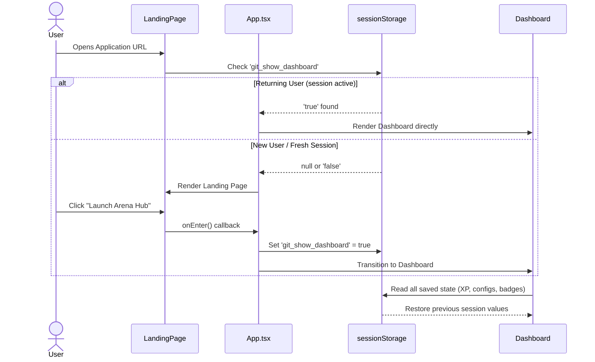

### XP Reward Pipeline

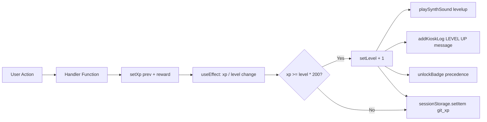

### Badge Unlock Sequence

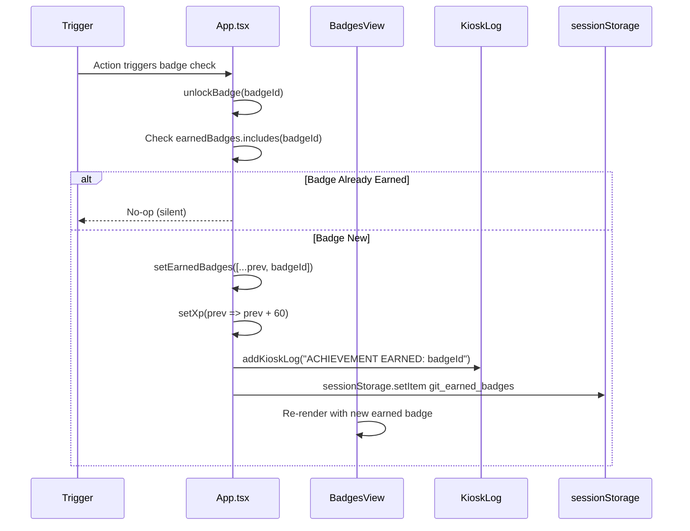

### Reactor Game Loop

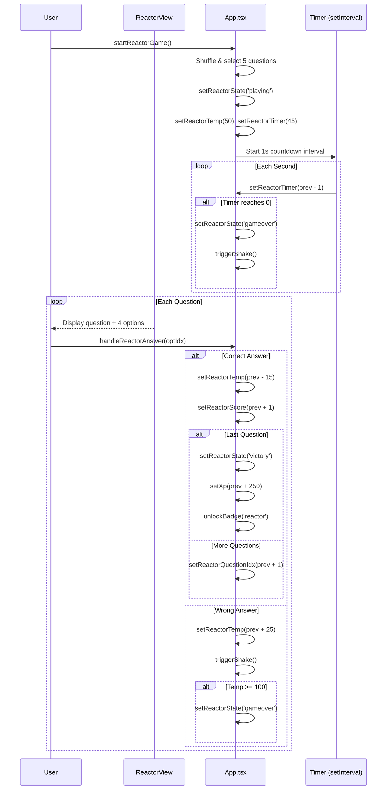

---

## 🔊 Audio Synthesis Engine

The application uses a custom Web Audio API synthesizer (`audio.ts`) that generates all sound effects programmatically — no audio files are loaded, eliminating network requests and ensuring instant, zero-latency audio feedback.

**Synthesizer Architecture:**

```typescript
export const playSynthSound = (type: 'click' | 'success' | 'levelup' | 'error' | 'reactor') => {
  const ctx = new AudioContext();
  const osc = ctx.createOscillator();  // Tone generator
  const gain = ctx.createGain();        // Volume envelope

  osc.connect(gain);
  gain.connect(ctx.destination);        // Output to speakers
  // ...type-specific configuration
};
```

**Sound Profile Reference:**

| Event | Waveform | Frequency Profile | Duration | Feel |
|-------|----------|-------------------|----------|------|
| `click` | Sine | 650Hz → 180Hz exponential | 80ms | Crisp tap |
| `success` | Triangle | 320Hz → 480Hz → 640Hz stair | 380ms | Ascending chime |
| `levelup` | Sine | C4 → E4 → G4 → C5 → E5 → G5 → C6 | 700ms | Victory fanfare |
| `error` | Sawtooth | 130Hz → 60Hz linear | 250ms | Low-frequency buzz |
| `reactor` | Square | 220Hz → 110Hz step | 400ms | Warning alarm tone |

**Sound Events Mapped to Actions:**

| User Action | Sound |
|------------|-------|
| Navigate module / click button | `click` |
| git add / commit / push success | `success` |
| Level up | `levelup` |
| Wrong answer / empty pipeline / logout | `error` |
| Reactor answer click | `click` |

Sound can be toggled globally via the `soundsOn` state. When `soundsOn === false`, the `triggerSound()` wrapper short-circuits without creating any `AudioContext` instances.

---

## 💾 Session Storage Schema

All application state is persisted to `sessionStorage` using string keys. State is read during initialization via `useState` lazy initializers and written back via a unified `useEffect` sync loop.

**Storage Key Reference:**

| Key | Type | Default | Description |
|-----|------|---------|-------------|
| `git_show_dashboard` | `"true" \| "false"` | `"false"` | Controls landing page vs. dashboard view |
| `git_configs` | JSON string | `INITIAL_CONFIGS` | User's live configuration registry |
| `git_xp` | number string | `"50"` | Current experience points total |
| `git_level` | number string | `"1"` | Current progression level |
| `git_mastered_missions` | JSON array | `"[]"` | IDs of completed missions |
| `git_earned_badges` | JSON array | `"[]"` | IDs of unlocked achievement badges |
| `git_unset_config` | `"true" \| "false"` | `"false"` | Whether `--unset` has been performed |
| `git_reset_performed` | `"true" \| "false"` | `"false"` | Whether pipeline reset has been performed |

**Synchronization Effect:**

```typescript
useEffect(() => {
  sessionStorage.setItem('git_show_dashboard', String(showDashboard));
  sessionStorage.setItem('git_configs', JSON.stringify(configs));
  sessionStorage.setItem('git_xp', String(xp));
  sessionStorage.setItem('git_level', String(level));
  sessionStorage.setItem('git_mastered_missions', JSON.stringify(masteredMissions));
  sessionStorage.setItem('git_earned_badges', JSON.stringify(earnedBadges));
  sessionStorage.setItem('git_unset_config', String(hasUnsetConfig));
  sessionStorage.setItem('git_reset_performed', String(hasResetPerformed));
}, [showDashboard, configs, xp, level, masteredMissions, earnedBadges, hasUnsetConfig, hasResetPerformed]);
```

> **Data Lifecycle Note:** All `sessionStorage` data is cleared automatically when the browser tab or window is closed. The `handleLogout()` function also calls `sessionStorage.clear()` explicitly, resetting the entire session.

---

## 📱 Responsive Design

The application is fully responsive across three breakpoint tiers:

| Breakpoint | Range | Layout Behavior |
|-----------|-------|----------------|
| **Mobile** | < 640px (`sm`) | Single-column stacked layout; mobile navigation stepper active |
| **Tablet** | 640px – 1280px | Two-column grids; horizontal HUD bars |
| **Desktop** | > 1280px (`xl`) | Full multi-column layouts; side-by-side panels |

**Key Responsive Patterns:**

- **Landing Page Hero** — Title scales from `text-6xl` (mobile) to `text-9xl` (desktop)
- **Campaign Cards** — `grid-cols-1` → `grid-cols-3` at `md` breakpoint
- **Glossary View** — Terminal and holographic viewer stack vertically on mobile, side-by-side on `lg`
- **HUD Status Bar** — Flexbox row on `sm+`, column on mobile with centered items
- **Badge Grid** — `grid-cols-1` → `grid-cols-2` → `grid-cols-3` progression

---

## 🎨 Design System

### Color Palette

The application uses CSS custom properties for theming, mapped through TailwindCSS's `extend` configuration:

| Token | Hex Value | Usage |
|-------|-----------|-------|
| `--color-brand-500` / `emerald-500` | `#10b981` | Primary brand accent, active elements |
| `--color-brand-400` / `emerald-400` | `#34d399` | Secondary text highlights |
| `--color-brand-950` / `emerald-950` | `#022c22` | Dark borders, card backgrounds |
| `--color-bg-primary` | `#030a06` | Main application background |
| `amber-500` | `#f59e0b` | Warning states, leaderboard accents |
| `red-500` | `#ef4444` | Error states, reactor danger indicators |
| `cyan-400` | `#22d3ee` | System metrics, SSL indicators |

### Typography

| Font Family | Weight Range | Usage Context |
|-------------|-------------|---------------|
| **Inter** | 300–900 | Body text, UI labels, descriptions |
| **Fira Code** | 400–500 | Terminal output, code blocks, command displays |

Typography scale follows a strict hierarchy:
- `text-9xl font-black` — Hero titles (Landing page only)
- `text-3xl font-black` — Section headings
- `text-xl font-bold` — Card headings
- `text-sm / text-xs` — Body content
- `text-[10px] / text-[9px]` — Metadata, badges, HUD labels

### Animation Tokens

| Class | Behavior | Duration | Usage |
|-------|----------|----------|-------|
| `animate-pulse` | Opacity oscillation | 2s | Status indicators, active badges |
| `animate-fadeIn` | Opacity 0 → 1 + translateY | 0.4s | View transitions |
| `animate-bounce` | Vertical bounce | 1s | Victory/error icons |
| `animate-spin` | Full 360° rotation | 1s | Loading states, init shield |
| `animate-ping` | Scale + fade out | 1s | Online status dots |
| `transition-all` | All CSS properties | 300ms | Hover state transitions |
| Shake animation | TranslateX oscillation | 450ms | Wrong answer feedback |

---

## 🧪 Testing

### Manual Testing Checklist

**Core Navigation:**
- [ ] Landing page loads with live metrics updating every 4 seconds
- [ ] Terminal console cycles through 7 log messages sequentially
- [ ] "Launch Arena Hub" button transitions to Dashboard with `levelup` sound
- [ ] All 13 sidebar navigation modules load without errors
- [ ] Logout resets all state and returns to Landing page

**Configuration Editor:**
- [ ] Update `user.name` — kiosk log shows `$ git config --global user.name "..."` 
- [ ] Update `user.email` — `arborist` badge criteria activates
- [ ] Remove a config key — kiosk log shows `$ git config --global --unset <key>`
- [ ] Add custom key via Registry form — appears in config list

**Pipeline Sandbox:**
- [ ] `git add` button moves files from Working Directory to Staging (+30 XP)
- [ ] `git commit` button creates commit with random hash (+50 XP)
- [ ] `git push` button moves commits to Remote column (+80 XP)
- [ ] All three operations sequentially unlock oxygenizer → carbon → canopy badges
- [ ] Reset button restores pipeline to initial state
- [ ] Warning log appears when operations run out of order (e.g., commit with empty staging)

**Conflict Reactor:**
- [ ] "Initialize Conflict Reactor" starts timer at 45 seconds
- [ ] Correct answer reduces temperature by 15%
- [ ] Wrong answer increases temperature by 25% and triggers screen shake
- [ ] Temperature reaching 100% ends game with "REACTOR OVERHEAT" screen
- [ ] Timer reaching 0 ends game with "REACTOR OVERHEAT" screen
- [ ] Answering all 5 questions correctly triggers "REACTOR STABILIZED" victory
- [ ] Victory awards +250 XP and unlocks `reactor` badge
- [ ] Questions and answer orders differ on each new game start

**Achievement System:**
- [ ] Badges with unmet criteria show "LOCKED OVERRIDE" status
- [ ] Criteria checklist shows "✓ ACTIVE" vs "✗ PENDING" for each requirement
- [ ] Clicking a badge with met criteria grants it and shows "SEAL CLAIMED"
- [ ] Clicking a badge with unmet criteria shows error log in kiosk

**Audio:**
- [ ] Sound toggle mutes all audio
- [ ] Each sound event type is distinguishably different
- [ ] Level-up sound plays ascending scale

### Browser Compatibility

| Browser | Version | Status | Notes |
|---------|---------|--------|-------|
| Chrome | 90+ | ✅ Full Support | Recommended primary browser |
| Firefox | 90+ | ✅ Full Support | Web Audio API fully supported |
| Safari | 15+ | ✅ Full Support | Uses `webkitAudioContext` fallback |
| Edge | 90+ | ✅ Full Support | Chromium-based, full compatibility |
| Mobile Chrome | Latest | ✅ Full Support | Touch events for pipeline interactions |
| Mobile Safari | 15+ | ✅ Full Support | AudioContext requires user gesture |

> **AudioContext Note:** On mobile browsers (especially iOS Safari), the Web Audio API requires a user gesture before creating an `AudioContext`. The application's button-driven interactions naturally satisfy this requirement since all sound events are triggered by user clicks.

---

## 🚀 Deployment

### Static Hosting (Recommended)

Since Git Config Master Toolkit is a fully static single-page application (SPA), it can be hosted on any static file server.

**Build and deploy in two steps:**

```bash
# 1. Generate production build
npm run build

# 2. Deploy the dist/ directory to your hosting provider
```

**Recommended Platforms:**

| Platform | Setup | Command |
|----------|-------|---------|
| **Vercel** | Connect GitHub repo | Auto-deploys on push to `main` |
| **Netlify** | Connect GitHub repo | Auto-deploys on push to `main` |
| **GitHub Pages** | GitHub Actions workflow | See workflow below |
| **Cloudflare Pages** | Connect GitHub repo | Auto-deploys on push to `main` |
| **AWS S3 + CloudFront** | Manual upload | `aws s3 sync dist/ s3://bucket-name` |

**GitHub Pages Deployment Workflow:**

Create `.github/workflows/deploy.yml`:

```yaml
name: Deploy to GitHub Pages

on:
  push:
    branches: [main]

jobs:
  deploy:
    runs-on: ubuntu-latest
    steps:
      - uses: actions/checkout@v4

      - name: Setup Node.js
        uses: actions/setup-node@v4
        with:
          node-version: '20'
          cache: 'npm'

      - name: Install dependencies
        run: npm ci

      - name: Build
        run: npm run build

      - name: Deploy to GitHub Pages
        uses: peaceiris/actions-gh-pages@v3
        with:
          github_token: ${{ secrets.GITHUB_TOKEN }}
          publish_dir: ./dist
```

### Docker Deployment

**Dockerfile:**

```dockerfile
# Stage 1: Build
FROM node:20-alpine AS builder
WORKDIR /app
COPY package*.json ./
RUN npm ci
COPY . .
RUN npm run build

# Stage 2: Serve
FROM nginx:alpine
COPY --from=builder /app/dist /usr/share/nginx/html
COPY nginx.conf /etc/nginx/nginx.conf
EXPOSE 80
CMD ["nginx", "-g", "daemon off;"]
```

**nginx.conf** (for SPA routing):

```nginx
server {
    listen 80;
    root /usr/share/nginx/html;
    index index.html;

    location / {
        try_files $uri $uri/ /index.html;
    }

    location ~* \.(js|css|png|jpg|gif|ico|svg)$ {
        expires 1y;
        add_header Cache-Control "public, immutable";
    }
}
```

**Build and run:**

```bash
docker build -t git-config-master .
docker run -p 8080:80 git-config-master
# Access at http://localhost:8080
```

### CI/CD Pipeline

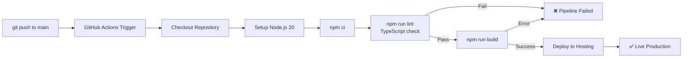

---

## 🔒 Security & Privacy

### Data Handling Policy

Git Config Master Toolkit is designed with a **zero-data-collection** architecture:

| Data Type | Stored Where | Persistence | Transmitted |
|-----------|-------------|-------------|-------------|
| Configuration values | sessionStorage | Tab session only | Never |
| XP / Level / Badges | sessionStorage | Tab session only | Never |
| Team member emails | React state | Tab session only | Never |
| Quiz answers | React state | Not persisted | Never |
| Any personal data | — | — | Never |

### Security Practices

**1. No External Data Transmission**
The application makes zero outbound HTTP requests with user data. External requests are limited to:
- CDN resources (TailwindCSS, Google Fonts, React ESM modules) — loaded only at initial page load
- All resource URLs are HTTPS

**2. sessionStorage Isolation**
`sessionStorage` data is scoped to the specific tab and origin. It cannot be accessed by other tabs, other domains, or browser extensions (without elevated permissions).

**3. No Authentication Surface**
There are no login forms, passwords, tokens, or authentication flows. This eliminates the largest class of web application vulnerabilities (credential theft, session hijacking, CSRF).

**4. Input Validation**
The Registry Editor validates configuration key input before storing. Empty keys are rejected with a guard condition:
```typescript
const handleUpdateConfig = (key: string, val: string) => {
  if (!key.trim()) return; // Reject empty keys
  setConfigs(prev => ({ ...prev, [key]: val }));
};
```

**5. Dependency Security**
The project uses a minimal dependency footprint. Run periodic audits:
```bash
npm audit
npm audit fix
```

**6. Content Security**
No `dangerouslySetInnerHTML` is used anywhere in the codebase. All user-provided values are stored in React state and rendered as text content, not HTML.

---

## 📈 Scalability Considerations

### Current Architecture Limits

The current client-side-only architecture scales exceptionally well for individual learning use cases but has natural limitations for multi-user features:

| Feature | Current Limit | Scaling Path |
|---------|--------------|--------------|
| Concurrent users | Unlimited (no server) | N/A — stateless static hosting |
| Question bank | 30 questions | Expandable in `App.tsx` array |
| Badge catalog | 6 badges | Extendable via `badgeLibrary` array in `App.tsx` |
| Team members | Unlimited (React state) | Backend API for persistence |
| Leaderboard | Mock static data | Backend with real-time WebSocket |
| Session data | sessionStorage (5MB limit) | No action needed; far below limit |

### Performance Characteristics

| Metric | Target | Current Status |
|--------|--------|---------------|
| Initial Load | < 2s | ✅ Sub-second (no server roundtrips) |
| Time to Interactive | < 1s | ✅ React hydration is instant |
| Bundle Size | < 500KB | ✅ Minimal dependencies |
| Animation Frame Rate | 60fps | ✅ CSS animations, no JS animation loops |
| Audio Latency | < 50ms | ✅ Web Audio API synthesizer is near-zero latency |

### Future Scaling Roadmap

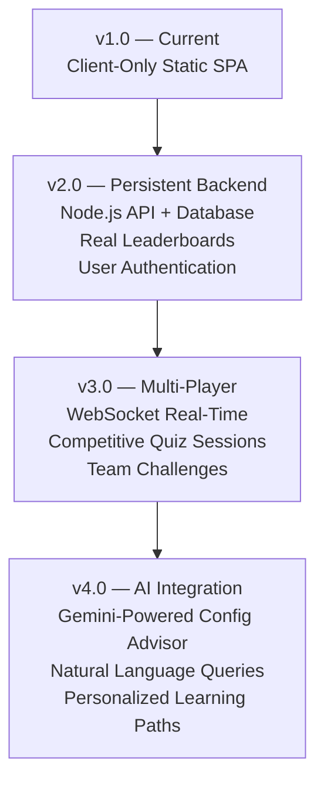

---

## 🐛 Troubleshooting

### Common Issues & Solutions

**Issue: Application shows blank page after `npm run dev`**

```bash
# Check for TypeScript errors
npm run lint

# Clear node_modules and reinstall
rm -rf node_modules package-lock.json
npm install
npm run dev
```

**Issue: Audio sounds not playing**

- Most browsers require a user gesture before creating an `AudioContext`. Click any button first.
- Check that the sound toggle is enabled (speaker icon in the dashboard header).
- Verify your system volume and browser tab is not muted.
- Safari on iOS: Audio will work after the first interaction with the page.

**Issue: Session state not persisting across page refresh**

Verify `sessionStorage` is accessible in your browser:
```javascript
// Run in browser console
sessionStorage.setItem('test', 'value');
sessionStorage.getItem('test'); // Should return 'value'
```

If `sessionStorage` is blocked, check:
- Browser's privacy/incognito mode settings (some browsers block `sessionStorage` in incognito)
- Third-party cookie blocking settings (some extensions affect `sessionStorage`)

**Issue: TailwindCSS styles not applying correctly**

The application uses TailwindCSS via CDN with a custom config block. If styles appear broken:
1. Open browser DevTools → Console. Check for script loading errors.
2. Verify the TailwindCSS CDN `<script>` tag in `index.html` has not been removed.
3. Clear browser cache and hard-reload (`Ctrl + Shift + R` / `Cmd + Shift + R`).

**Issue: Reactor timer continues after component unmounts**

This is handled by the `useEffect` cleanup return:
```typescript
useEffect(() => {
  // Timer setup...
  return () => {
    if (timerRef.current) clearInterval(timerRef.current);
  };
}, [reactorState]);
```

If you observe timer leaks during development (HMR edge case), stop and restart the dev server:
```bash
# Stop server (Ctrl+C), then:
npm run dev
```

**Issue: Pointer drag on scope wheel feels unresponsive**

The wheel uses `setPointerCapture` for smooth tracking. If the wheel feels unresponsive:
- Ensure JavaScript pointer events are not blocked by any browser extension
- Try in a different browser to isolate browser-specific pointer event handling
- On touch devices, ensure the browser's default touch behavior (scroll) is not intercepting pointer events

**Issue: `npm run lint` reports TypeScript errors**

Common error patterns and fixes:

```typescript
// Error: Object is possibly 'null'
// Fix: Use optional chaining
element?.doSomething();

// Error: Type 'string | null' is not assignable to type 'string'
// Fix: Add null check
const value = sessionStorage.getItem('key') ?? 'default';

// Error: Argument of type 'string' is not assignable to parameter of type 'never'
// Fix: Ensure discriminated union is handled completely
```

---

## ❓ Frequently Asked Questions

**Q: Does Git Config Master Toolkit require internet access to work?**

A: After initial load (which fetches TailwindCSS CDN, Google Fonts, and React from ESM.sh), the application is fully functional offline. All logic, data, and audio synthesis are self-contained in the JavaScript bundle.

---

**Q: Will my progress save when I close the browser?**

A: No. The application uses `sessionStorage` which is cleared when the browser tab or window closes. This is a deliberate design decision to ensure each learning session starts fresh. If you want to continue from where you left off, keep the tab open.

---

**Q: Can I run the Conflict Reactor multiple times to get different questions?**

A: Yes. The 30-question bank is shuffled on every game start, and 5 questions are selected from the shuffled pool. Answer order within each question is also randomized. Over time, all 30 questions will be encountered.

---

**Q: Are the Git commands in the database safe to run on my actual system?**

A: The commands in the `gitCommands.ts` database are real, documented Git commands. However, destructive commands (e.g., `git reset --hard`, `git clean -fd`) are clearly labeled with warnings in their description. Always understand a command before running it on a real repository.

---

**Q: How do I claim a badge that I believe I've completed but it still shows as locked?**

A: Click the badge card directly. The system will run a live criteria check against your current session state. If all criteria are met, the badge will be sealed. The Kiosk Log at the bottom of the screen will show the verification result. If you see "VERIFICATION DENIED," check the criteria checklist items — one or more conditions may not yet be satisfied.

---

**Q: Can I add the application to my GitHub profile to showcase it?**

A: Absolutely. Fork the repository, customize the team members and leaderboard names in `LandingPage.tsx`, and deploy to GitHub Pages, Vercel, or Netlify. Consider adding your own questions to the Reactor quiz bank in `App.tsx` to expand the educational content.

---

**Q: What happens if I edit the `sessionStorage` values manually in DevTools?**

A: The application reads `sessionStorage` only on initialization (page load). Manually modifying values will take effect on the next page refresh. The format must match the expected types — JSON arrays for badge/mission lists, numeric strings for XP/level, JSON objects for configs. Invalid values will silently fall back to defaults via the null-coalescing patterns in the `useState` initializers.

---

**Q: How is the Academy Certificate generated?**

A: The certificate is rendered as a React component (`CertificateCard.tsx`) using the learner's current `user.name` config value and the list of `masteredMissions`. Triggering the browser's print dialog (`Ctrl+P` / `Cmd+P`) from the certificate modal will produce a clean, formatted PDF with the certificate layout.

---

**Q: Is there a way to test all features without earning XP organically?**

A: Yes. The Badges view includes a Sandbox Override mode — clicking any locked badge card while its criteria are met will immediately seal it. For the Reactor badge specifically, you need to win the game. For configuration badges, update the `user.name` and `user.email` values in the Registry Editor to non-default values.

---

## 🤝 Contributing

Contributions are welcome and appreciated. Whether you're fixing a bug, adding a question to the Reactor quiz bank, improving documentation, or proposing a new feature, the process below will get you started.

### Getting Started

**1. Fork the repository:**

```bash
# Fork via GitHub UI, then clone your fork
git clone https://github.com/YOUR_USERNAME/GitConfigMaster-Toolkit.git
cd GitConfigMaster-Toolkit
```

**2. Create a feature branch:**

```bash
# Use descriptive branch names
git switch -c feature/add-rebase-questions
git switch -c fix/reactor-timer-cleanup
git switch -c docs/update-installation-guide
```

**3. Make your changes and test locally:**

```bash
npm install
npm run dev
npm run lint  # Ensure no TypeScript errors
```

**4. Commit with conventional commit messages:**

```bash
# Format: type(scope): description
git commit -m "feat(reactor): add 10 rebase-focused questions to quiz bank"
git commit -m "fix(audio): resolve AudioContext leak on component unmount"
git commit -m "docs(readme): add Docker deployment section"
git commit -m "style(landing): adjust hero title responsive breakpoints"
```

**Commit Types:**

| Type | Usage |
|------|-------|
| `feat` | New feature or capability |
| `fix` | Bug fix |
| `docs` | Documentation changes |
| `style` | Formatting, whitespace (no logic change) |
| `refactor` | Code restructuring without behavior change |
| `test` | Adding or updating tests |
| `chore` | Dependency updates, build config changes |

**5. Push and open a Pull Request:**

```bash
git push origin feature/add-rebase-questions
```

Then open a PR on GitHub against the `main` branch.

### Contribution Guidelines

- **TypeScript required** — All new code must be fully typed. No `any` types without documented justification.
- **Component isolation** — New UI features belong in separate files under `components/`. Avoid adding logic to `App.tsx` unless it's shared state.
- **Accessibility** — Use semantic HTML elements. Interactive elements must have descriptive `aria-label` attributes where visual context is insufficient.
- **Responsive design** — All UI additions must be tested at mobile (375px), tablet (768px), and desktop (1280px) widths.
- **Sound integration** — New user interactions should call `triggerSound()` with an appropriate type for tactile feedback.
- **Documentation** — Update this README for significant feature additions, especially new components or configuration options.

### Adding Reactor Questions

To expand the quiz bank, add questions to the `ALL_30_QUESTIONS` array in `App.tsx`:

```typescript
{
  q: "Your question text here — be specific and unambiguous.",
  opts: [
    "A) Correct answer option",
    "B) Plausible but incorrect option",
    "C) Common misconception option",
    "D) Another incorrect option"
  ],
  ans: 0  // Index of the correct answer (0 = option A)
}
```

**Question Quality Guidelines:**
- Questions should cover Git config or workflow concepts directly
- All four options should be plausible (avoid obviously wrong answers)
- The correct answer should be verifiable against official Git documentation
- Questions should not require knowledge of third-party tools or platform-specific behavior

### GitHub CLI Setup for Repository Metadata

After forking and customizing, set your repository description and topics using the GitHub CLI:

```bash
# Install GitHub CLI if not already installed
# https://cli.github.com/

# Authenticate
gh auth login

# Set repository description
gh repo edit YOUR_USERNAME/GitConfigMaster-Toolkit \
  --description "Interactive gamified Git configuration learning toolkit — master scopes, precedence, pipelines & conflict resolution"

# Set repository topics
gh repo edit YOUR_USERNAME/GitConfigMaster-Toolkit \
  --add-topic "git" \
  --add-topic "git-configuration" \
  --add-topic "react" \
  --add-topic "typescript" \
  --add-topic "vite" \
  --add-topic "gamification" \
  --add-topic "interactive-learning" \
  --add-topic "developer-tools" \
  --add-topic "education" \
  --add-topic "git-tutorial" \
  --add-topic "web-audio-api" \
  --add-topic "dark-theme" \
  --add-topic "tailwindcss" \
  --add-topic "learning-platform"

# Verify changes
gh repo view YOUR_USERNAME/GitConfigMaster-Toolkit
```

---

## 📄 License

This project is licensed under the **MIT License**.

```
MIT License

Copyright (c) 2026 Godfrey & Prithiviiraj — Orion-OS Platform Architects

Permission is hereby granted, free of charge, to any person obtaining a copy
of this software and associated documentation files (the "Software"), to deal
in the Software without restriction, including without limitation the rights
to use, copy, modify, merge, publish, distribute, sublicense, and/or sell
copies of the Software, and to permit persons to whom the Software is
furnished to do so, subject to the following conditions:

The above copyright notice and this permission notice shall be included in all
copies or substantial portions of the Software.

THE SOFTWARE IS PROVIDED "AS IS", WITHOUT WARRANTY OF ANY KIND, EXPRESS OR
IMPLIED, INCLUDING BUT NOT LIMITED TO THE WARRANTIES OF MERCHANTABILITY,
FITNESS FOR A PARTICULAR PURPOSE AND NONINFRINGEMENT. IN NO EVENT SHALL THE
AUTHORS OR COPYRIGHT HOLDERS BE LIABLE FOR ANY CLAIM, DAMAGES OR OTHER
LIABILITY, WHETHER IN AN ACTION OF CONTRACT, TORT OR OTHERWISE, ARISING FROM,
OUT OF OR IN CONNECTION WITH THE SOFTWARE OR THE USE OR OTHER DEALINGS IN THE
SOFTWARE.
```

---

## 🙏 Acknowledgements

This project was built with gratitude to the open-source community and the following resources:

| Resource | Contribution |
|----------|-------------|
| [React](https://react.dev) | The UI framework that powers all interactive components |
| [Vite](https://vitejs.dev) | The build tooling enabling instant HMR and fast production builds |
| [TypeScript](https://www.typescriptlang.org) | Type safety that made the complex state machine maintainable |
| [TailwindCSS](https://tailwindcss.com) | The utility-first CSS framework powering the entire visual system |
| [Google Fonts](https://fonts.google.com) | Inter and Fira Code typography powering the reading experience |
| [Web Audio API](https://developer.mozilla.org/en-US/docs/Web/API/Web_Audio_API) | Native browser audio synthesis for zero-dependency sound effects |
| [Git Documentation](https://git-scm.com/doc) | Official source for all configuration keys, command behavior, and scope documentation |
| [GitHub Training](https://training.github.com) | Reference for the official Git cheatsheet linked in the platform |
| [Pro Git Book](https://git-scm.com/book) | Scott Chacon & Ben Straub's authoritative Git reference for quiz question accuracy |

---

<div align="center">

### Built with 💚 by the Orion-OS Platform Team

**Godfrey** · **Prithiviiraj**

*"The best way to learn Git is to feel it — not just read about it."*

---

[](https://github.com/TheOrionGD)
[](https://github.com/TheOrionGD/GitConfigMaster-Toolkit)

---

*If this toolkit accelerated your Git mastery, consider giving it a ⭐ on GitHub.*

</div>
